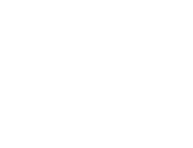

<p align="center">
  
</p>

<h1 align="center">Painel Digital Balance</h1>

<p align="center">
  <strong>Sistema de exibição de mapas de aulas para TV — All Black Design</strong>
</p>

<p align="center">
  
  
  
  
</p>

---

## 🎯 Sobre o Projeto

O **Painel Digital Balance** é uma aplicação web pensada para ser exibida continuamente num ecrã/TV no ginásio **Balance Fitness Club**, em Verdemilho, Aradas — Aveiro. Mostra os mapas de aulas (Piscina e Ginásio) em tempo real, com um design premium totalmente escuro.

---

## ✨ Funcionalidades

| Funcionalidade | Descrição |
|---|---|
| 🗓️ **Mapas de Aulas** | Exibe 2 mapas lado a lado (Piscina + Aulas em Grupo) em formato PDF |
| 🌤️ **Previsão do Tempo** | Temperatura em tempo real para Verdemilho, Aradas (via [Open-Meteo](https://open-meteo.com/)) |
| 🕐 **Relógio Digital** | Hora em tempo real, atualizada a cada segundo |
| 👋 **Saudação Dinâmica** | Exibe "Bom Dia", "Boa Tarde" ou "Boa Noite" conforme o horário |
| 🔄 **Auto-Refresh** | Relógio (1s), Meteorologia (30min), Mapas PDF (24h) |
| 📄 **Google Drive** | PDFs são servidos diretamente do Google Drive via Google Apps Script |

---

## 🖥️ Layout

```
┌──────────────────────────────────────────────────────────┐
│  🏋️ LOGO          Boa Tarde          ⛅ 17°C │ 16:58  │
├────────────────────────────┬─────────────────────────────┤
│                            │                             │
│     MAPA PISCINA (PDF)     │    AULAS EM GRUPO (PDF)     │
│                            │                             │
│                            │                             │
│                            │                             │
└────────────────────────────┴─────────────────────────────┘
```

---

## 🛠️ Tecnologias

- **Frontend**: HTML5, CSS3, JavaScript (Vanilla)
- **Fontes**: [Montserrat](https://fonts.google.com/specimen/Montserrat), [Inter](https://fonts.google.com/specimen/Inter), Iosevka Charon Mono (local)
- **API Meteorologia**: [Open-Meteo](https://open-meteo.com/) (gratuita, sem chave API)
- **Backend**: Google Apps Script → retorna JSON com links dos PDFs
- **Armazenamento**: Google Drive (PDFs dos mapas de aulas)

---

## 📁 Estrutura do Projeto

```
paineldigitalbalance/
├── assets/
│   └── newlogobc_white.png    # Logo do Balance
├── index.html                 # Aplicação principal
└── README.md                  # Este ficheiro
```

---

## ⚙️ Configuração

### 1. API URL

No ficheiro `index.html`, a variável `API_URL` contém o endpoint do Google Apps Script que retorna o JSON com os links dos mapas:

```javascript
const API_URL = "https://script.google.com/macros/s/.../exec";
```

### 2. Formato do JSON esperado

O endpoint deve retornar:

```json
{
  "piscina": "https://drive.google.com/file/d/FILE_ID/view",
  "ginasio": "https://drive.google.com/file/d/FILE_ID/view"
}
```

### 3. Fonte Local (Opcional)

A saudação usa a fonte **Iosevka Charon Mono**. Para que funcione, esta deve estar instalada no sistema operativo do dispositivo. Caso contrário, é utilizada a fonte **Inter** como fallback.

---

## 🕐 Intervalos de Atualização

| Componente | Intervalo |
|---|---|
| Relógio | 1 segundo |
| Meteorologia | 30 minutos |
| Mapas PDF | 24 horas |

---

## 🚀 Como Usar

1. **Abrir o link** do painel no browser da TV em modo ecrã inteiro (`F11`)
2. ✅ O painel atualiza-se automaticamente — não precisa de interação!

---

## 🎨 Design

- **Tema**: All Black Premium (`#000000`)
- **Cartões**: Fundo `#0a0a0a` com borda sutil `#1f1f1f` e `border-radius: 12px`
- **Layout**: Flexbox 50/50 para os dois painéis
- **Tipografia**: Montserrat (geral), Inter (relógio), Iosevka Charon Mono (saudação)

---

<p align="center">
  Feito com 🖤 para o <strong>Balance Fitness Club</strong> — Verdemilho, Aradas, Aveiro
</p>
